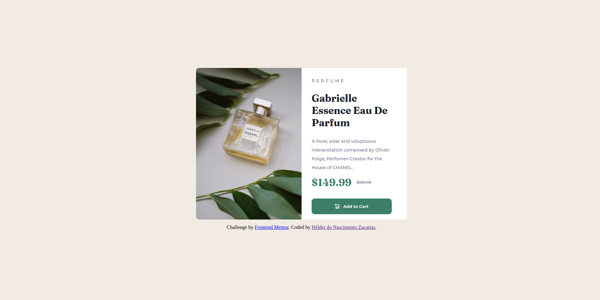

# Frontend Mentor - Product preview card component solution

This is a solution to the [Product preview card component challenge on Frontend Mentor](https://www.frontendmentor.io/challenges/product-preview-card-component-GO7UmttRfa). Frontend Mentor challenges help you improve your coding skills by building realistic projects. 

## Table of contents

- [Overview](#overview)
  - [The challenge](#the-challenge)
  - [Screenshot](#screenshot)
  - [Links](#links)
- [My process](#my-process)
  - [Built with](#built-with)
  - [What I learned](#what-i-learned)
  - [Continued development](#continued-development)
  - [Useful resources](#useful-resources)
- [Author](#author)

## Overview

### The challenge

Users should be able to:

- View the optimal layout depending on their device's screen size
- See hover and focus states for interactive elements

### Screenshot

### Links

- [GitHub Repository](https://github.com/helderzack/frontend-mentor-product-preview-card-component)

## My process

### Built with

- Semantic HTML5 markup
- Flexbox

### What I learned

I consider myself a beginner frontend developer, but this project was useful for me to practice with some concepts I still struggle with, like positioning of elements and the use of flexbox in general. With that being said, , I believe I'm a better developer now, after the beginning of development of this project.

### Continued development

The project is not finished yet. I have work to do on the responsiveness of the site. Right now, the display of elements on small screens is appaling, so I have to work with media queries. Also, I need to host this website on some platform. When I'm done developing it, I'll attend to that.

### Useful resources

- [CSS Tricks - A Complete Guide to Flexbox](https://css-tricks.com/snippets/css/a-guide-to-flexbox/) - This resource helped me with working with flexbox, espcially on the positioning of the elements. CSS Tricks is a really valuable resource with a so much CSS content. It's awesome.

- [Add Custom Fonts to Your Websites Using Google Fonts - HTML & CSS Tutorial](https://www.youtube.com/watch?v=qgmLDPLApBY) - This video helped me on using the google fonts defined on the challenge. It's a simple process, but one I had absolutely no experience on, so this video helped me.

## Author

- Frontend Mentor - [@helderzack](https://www.frontendmentor.io/profile/helderzack)
